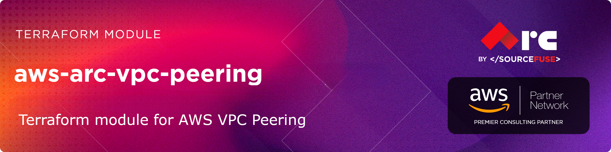

# [terraform-aws-arc-vpc-peering](https://github.com/sourcefuse/terraform-aws-arc-vpc-peering)

> **Module:** `sourcefuse/arc-vpc-peering/aws`

> **Registry:** [https://registry.terraform.io/modules/sourcefuse/arc-vpc-peering/aws](https://registry.terraform.io/modules/sourcefuse/arc-vpc-peering/aws)

> **Category:** Networking / VPC

> **Source:** [https://github.com/sourcefuse/terraform-aws-arc-vpc-peering](https://github.com/sourcefuse/terraform-aws-arc-vpc-peering)

[](https://github.com/sourcefuse/terraform-aws-arc-vpc-peering/releases/latest)
[](https://github.com/sourcefuse/terraform-aws-arc-vpc-peering/commits)


[](https://sonarcloud.io/summary/new_code?id=sourcefuse_terraform-aws-arc-vpc-peering)

> [!TIP]
> 🤖 **New:** Use this module with AI assistants via the [ARC IaC MCP Server](https://github.com/sourcefuse/arc-iac-mcp) — search, scaffold, and security-scan ARC modules from natural language. [Quick setup ↓](#ai-assistant-integration-arc-iac-mcp)

## Overview

Creates and manages VPC peering connections between two VPCs, including route table updates and DNS resolution settings.

## What It Does

- VPC peering connection creation and acceptance
- Route table updates on both requester and accepter sides
- Cross-account and cross-region peering support
- DNS resolution across peered VPCs
- Multiple peering connections in a single module call

For more information about this repository and its usage, please see [Terraform AWS VPC Peering Usage Guide](https://github.com/sourcefuse/terraform-aws-arc-vpc-peering/blob/main/docs/module-usage-guide/README.md).

## Quickstart
### Simple Same-Account Peering

```hcl
module "vpc_peering" {
  source = "sourcefuse/arc-vpc-peering/aws"

  providers = {
    aws.accepter = aws.accepter
  }

  connections = {
    "main" = {
      requester_vpc_id                = "vpc-12345678"
      accepter_vpc_id                 = "vpc-87654321"
      allow_remote_vpc_dns_resolution = true
    }
  }

  # Standard naming
  naming = {
    namespace   = "eg"
    environment = "prod"
    stage       = "staging"
    name        = "app"
  }

  tags = {
    Project = "MyProject"
  }
}
```
### Cross-Account Peering

```hcl
module "vpc_peering" {
  source = "sourcefuse/arc-vpc-peering/aws"

  providers = {
    aws.accepter = aws.accepter
  }

  connections = {
    "main" = {
      requester_vpc_id                = "vpc-12345678"
      accepter_vpc_id                 = "vpc-87654321"
      peer_owner_id                   = "123456789012"
      allow_remote_vpc_dns_resolution = true
    }
  }

  tags = {
    Environment = "production"
  }
}
```
### Cross-Region Peering

```hcl
module "vpc_peering" {
  source = "sourcefuse/arc-vpc-peering/aws"

  providers = {
    aws          = aws.us_east
    aws.accepter = aws.us_west
  }

  connections = {
    "main" = {
      requester_vpc_id                = "vpc-12345678"
      accepter_vpc_id                 = "vpc-87654321"
      peer_region                     = "us-west-2"
      allow_remote_vpc_dns_resolution = true
    }
  }

  tags = {
    Environment = "production"
  }
}
```
### Advanced Multi-Connection with Route Management

```hcl
module "vpc_peering" {
  source = "sourcefuse/arc-vpc-peering/aws"

  providers = {
    aws.accepter = aws.accepter
  }

  connections = {
    "web-to-app" = {
      requester_vpc_id                = "vpc-12345678"
      accepter_vpc_id                 = "vpc-87654321"
      auto_accept                     = true
      allow_remote_vpc_dns_resolution = true

      manage_routes                   = true
      requester_route_table_ids       = ["rtb-12345678"]
      accepter_route_table_ids        = ["rtb-87654321"]
      requester_destination_cidrs     = ["10.2.0.0/16"]
      accepter_destination_cidrs      = ["10.1.0.0/16"]
    }

    "app-to-db" = {
      requester_vpc_id                = "vpc-87654321"
      accepter_vpc_id                 = "vpc-abcdef12"
      peer_owner_id                   = "123456789012"
      auto_accept                     = false
      allow_remote_vpc_dns_resolution = true

      manage_routes                   = true
      requester_route_table_ids       = ["rtb-87654321"]
      accepter_route_table_ids        = ["rtb-abcdef12"]
      requester_destination_cidrs     = ["10.3.0.0/16"]
      accepter_destination_cidrs      = ["10.2.0.0/16"]
    }
  }

  tags = {
    Environment = "production"
    Project     = "multi-tier-architecture"
  }
}
    Project     = "multi-tier-architecture"
  }
}
```
## Provider Configuration

### Same Account, Same Region
```hcl
provider "aws" {
  region = "us-east-1"
}

provider "aws" {
  alias  = "accepter"
  region = "us-east-1"
}
```

### Cross-Region
```hcl
provider "aws" {
  region = "us-east-1"
}

provider "aws" {
  alias  = "accepter"
  region = "us-west-2"
}
```

### Cross-Account
```hcl
provider "aws" {
  region = "us-east-1"
}

provider "aws" {
  alias  = "accepter"
  region = "us-east-1"
  assume_role {
    role_arn = "arn:aws:iam::123456789012:role/CrossAccountRole"
  }
}
```

## Examples

The `examples/` directory contains complete, working examples:

- **[single-account](./examples/single-account/)**: Basic same-account VPC peering
- **[cross-account](./examples/cross-account/)**: Cross-account peering with IAM roles
- **[cross-region](./examples/cross-region/)**: Cross-region VPC connectivity
- **[with-routes-dns](./examples/with-routes-dns/)**: Full-featured peering with route management and DNS

```hcl
# Simple same-account peering
module "vpc_peering" {
  source = "sourcefuse/arc-vpc-peering/aws"

  providers = {
    aws.accepter = aws.accepter
  }

  connections = {
    "main" = {
      requester_vpc_id                = "vpc-12345678"
      accepter_vpc_id                 = "vpc-87654321"
      allow_remote_vpc_dns_resolution = false
    }
  }

  tags = {
    Environment = "production"
  }
}

# Cross-account peering
module "vpc_peering" {
  source = "sourcefuse/arc-vpc-peering/aws"

  providers = {
    aws.accepter = aws.accepter
  }

  connections = {
    "main" = {
      requester_vpc_id                = "vpc-12345678"
      accepter_vpc_id                 = "vpc-87654321"
      peer_owner_id                   = "123456789012"
      allow_remote_vpc_dns_resolution = true
    }
  }

  tags = {
    Environment = "production"
  }
}

# Cross-region peering
module "vpc_peering" {
  source = "sourcefuse/arc-vpc-peering/aws"

  providers = {
    aws          = aws.us_east
    aws.accepter = aws.us_west
  }

  connections = {
    "main" = {
      requester_vpc_id                = "vpc-12345678"
      accepter_vpc_id                 = "vpc-87654321"
      peer_region                     = "us-west-2"
      allow_remote_vpc_dns_resolution = true
    }
  }

  tags = {
    Environment = "production"
  }
}
```

## Required Inputs

| Name | Type | Description |
|------|------|-------------|
| `connections` | `map(object)` | Map of peering connection configurations |
## Key Outputs

| Name | Description |
|------|-------------|
| `peering_connection_ids` | Map of peering connection IDs |
| `peering_connection_statuses` | Map of peering connection statuses |
## Full Variable & Output Reference

The complete inputs/outputs reference is auto-generated below.

<!-- BEGINNING OF PRE-COMMIT-TERRAFORM DOCS HOOK -->
## Requirements

| Name | Version |
|------|---------|
| <a name="requirement_terraform"></a> [terraform](#requirement\_terraform) | >= 1.5.0 |
| <a name="requirement_aws"></a> [aws](#requirement\_aws) | >= 5.0, < 7.0 |

## Providers

| Name | Version |
|------|---------|
| <a name="provider_aws"></a> [aws](#provider\_aws) | 6.26.0 |
| <a name="provider_aws.accepter"></a> [aws.accepter](#provider\_aws.accepter) | 6.26.0 |

## Modules

No modules.

## Resources

| Name | Type |
|------|------|
| [aws_route.accepter](https://registry.terraform.io/providers/hashicorp/aws/latest/docs/resources/route) | resource |
| [aws_route.requester](https://registry.terraform.io/providers/hashicorp/aws/latest/docs/resources/route) | resource |
| [aws_vpc_peering_connection.this](https://registry.terraform.io/providers/hashicorp/aws/latest/docs/resources/vpc_peering_connection) | resource |
| [aws_vpc_peering_connection_accepter.cross_account](https://registry.terraform.io/providers/hashicorp/aws/latest/docs/resources/vpc_peering_connection_accepter) | resource |
| [aws_vpc_peering_connection_accepter.this](https://registry.terraform.io/providers/hashicorp/aws/latest/docs/resources/vpc_peering_connection_accepter) | resource |
| [aws_vpc_peering_connection_options.accepter](https://registry.terraform.io/providers/hashicorp/aws/latest/docs/resources/vpc_peering_connection_options) | resource |
| [aws_vpc_peering_connection_options.requester](https://registry.terraform.io/providers/hashicorp/aws/latest/docs/resources/vpc_peering_connection_options) | resource |

## Inputs

| Name | Description | Type | Default | Required |
|------|-------------|------|---------|:--------:|
| <a name="input_auto_accept_peering"></a> [auto\_accept\_peering](#input\_auto\_accept\_peering) | Automatically accept peering connections (same account only) | `bool` | `true` | no |
| <a name="input_connections"></a> [connections](#input\_connections) | Map of VPC peering connections to create | <pre>map(object({<br/>    requester_vpc_id = string<br/>    accepter_vpc_id  = string<br/>    peer_region      = optional(string)<br/>    peer_owner_id    = optional(string)<br/>    auto_accept      = optional(bool, true)<br/><br/>    # DNS settings<br/>    allow_remote_vpc_dns_resolution = optional(bool, false)<br/><br/>    # Route management<br/>    manage_routes               = optional(bool, false)<br/>    requester_route_table_ids   = optional(list(string), [])<br/>    accepter_route_table_ids    = optional(list(string), [])<br/>    requester_destination_cidrs = optional(list(string), [])<br/>    accepter_destination_cidrs  = optional(list(string), [])<br/><br/>    # Tags<br/>    tags = optional(map(string), {})<br/>  }))</pre> | `{}` | no |
| <a name="input_dns_resolution"></a> [dns\_resolution](#input\_dns\_resolution) | DNS resolution configuration | <pre>object({<br/>    requester_allow_remote_vpc_dns_resolution = optional(bool, true)<br/>    accepter_allow_remote_vpc_dns_resolution  = optional(bool, true)<br/>    enable_dns_resolution                     = optional(bool, false)<br/>  })</pre> | `{}` | no |
| <a name="input_naming"></a> [naming](#input\_naming) | Naming configuration for resources | <pre>object({<br/>    name        = optional(string, "")<br/>    namespace   = optional(string, "")<br/>    environment = optional(string, "")<br/>    stage       = optional(string, "")<br/>    delimiter   = optional(string, "-")<br/>    attributes  = optional(list(string), [])<br/>    label_order = optional(list(string), ["namespace", "environment", "stage", "name", "attributes"])<br/>  })</pre> | `{}` | no |
| <a name="input_tags"></a> [tags](#input\_tags) | Default tags to apply to all resources | `map(string)` | `{}` | no |
| <a name="input_timeouts"></a> [timeouts](#input\_timeouts) | VPC peering connection timeouts | <pre>object({<br/>    create = optional(string, "3m")<br/>    update = optional(string, "3m")<br/>    delete = optional(string, "5m")<br/>  })</pre> | `{}` | no |

## Outputs

| Name | Description |
|------|-------------|
| <a name="output_peering_connection_ids"></a> [peering\_connection\_ids](#output\_peering\_connection\_ids) | Map of peering connection names to their IDs |
| <a name="output_peering_connection_status"></a> [peering\_connection\_status](#output\_peering\_connection\_status) | Map of peering connection names to their status |
| <a name="output_peering_connections"></a> [peering\_connections](#output\_peering\_connections) | Complete peering connection details |
<!-- END OF PRE-COMMIT-TERRAFORM DOCS HOOK -->

## Versioning  
This project uses a `.version` file at the root of the repo which the pipeline reads from and does a git tag.  

When you intend to commit to `main`, you will need to increment this version. Once the project is merged,
the pipeline will kick off and tag the latest git commit.  

## Development

### Prerequisites

- [terraform](https://learn.hashicorp.com/terraform/getting-started/install#installing-terraform)
- [terraform-docs](https://github.com/segmentio/terraform-docs)
- [pre-commit](https://pre-commit.com/#install)
- [golang](https://golang.org/doc/install#install)
- [golint](https://github.com/golang/lint#installation)

### Configurations

- Configure pre-commit hooks
  ```sh
  pre-commit install
  ```

### Versioning

while Contributing or doing git commit please specify the breaking change in your commit message whether its major,minor or patch

For Example

```sh
git commit -m "your commit message #major"
```
By specifying this , it will bump the version and if you don't specify this in your commit message then by default it will consider patch and will bump that accordingly

### Tests
- Tests are available in `test` directory
- Configure the dependencies
  ```sh
  cd test/
  go mod init github.com/sourcefuse/terraform-aws-arc-vpc-peering
  go get github.com/gruntwork-io/terratest/modules/terraform
  ```
- Now execute the test  
  ```sh
  go test -timeout  30m
  ```

## AI Assistant Integration (ARC IaC MCP)

The **[ARC IaC MCP Server](https://github.com/sourcefuse/arc-iac-mcp)** is a hosted Model Context Protocol service that lets AI assistants browse, search, scaffold, compare, and security-scan any of the SourceFuse ARC Terraform modules — directly from natural language.

**What you can do with it:**

- **Discover** — search and filter modules by keyword or AWS resource type.
- **Understand** — get inputs, outputs, and resources for any module without leaving your editor.
- **Scaffold** — generate production-ready, multi-file Terraform with cross-module wiring already done.
- **Secure** — scan generated or existing HCL for misconfigurations before it hits a PR.
- **Compare** — diff modules side-by-side to make informed architectural decisions.

### Setup (one minute)

The MCP endpoint is `https://arc-iac-mcp.sourcef.us/mcp`. Pick your client:

**Claude Code CLI:**
```bash
claude mcp add arc-iac --transport http https://arc-iac-mcp.sourcef.us/mcp
```

**Claude Desktop** — edit `~/Library/Application Support/Claude/claude_desktop_config.json`:
```json
{
  "mcpServers": {
    "arc-iac": {
      "url": "https://arc-iac-mcp.sourcef.us/mcp"
    }
  }
}
```

**Cursor / Windsurf / Kiro** — add the same block to `.cursor/mcp.json` (or the equivalent for your client).

### Example prompts to try

- *"List all ARC modules sorted by downloads"*
- *"What inputs does `arc-ecs` require?"*
- *"Scaffold a production-ready `arc-db` Aurora setup with Secrets Manager"*
- *"Compare `arc-eks` and `arc-ecs` for running 10 microservices"*
- *"Scan this Terraform before I raise a PR: `<paste HCL>`"*

See the [ARC IaC MCP repo](https://github.com/sourcefuse/arc-iac-mcp) for the full tool reference, troubleshooting tips, and local-development instructions.

## Contributing

See [CONTRIBUTING.md](./CONTRIBUTING.md) for commit conventions and development setup.

## Authors

This project is authored by:
- SourceFuse ARC Team
